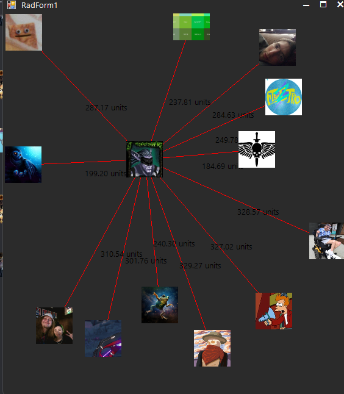

This was started as a project to impletent directional sound into discord via the RPC connection :

I have added more support to the [C# RPC wrapper](https://github.com/Lachee/discord-rpc-csharp) to allow for the setting and changing of audio controlls.

The project includes a basic UI that will display every user (and their display image on a form) the users are draggable and the audio volume % well be adjusted based on the distance each user is from the local user :

In order to run this project you will need to authorize the RPC client through the discord developer portal, As they no longer accept new users into it. I have develop an RPC auth bypass I will be sharing here in a few days once I have cleaned it up a bit!
